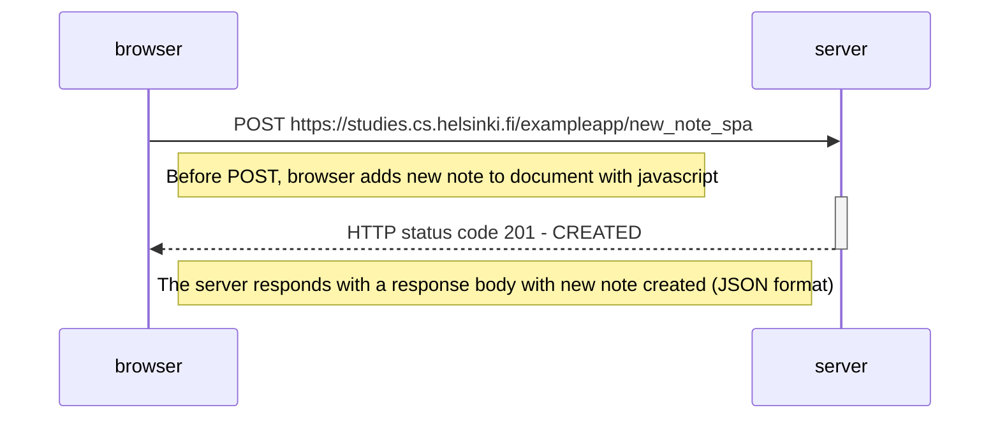

```mermaid
sequenceDiagram
participant browser
participant server

    browser->>server: POST https://studies.cs.helsinki.fi/exampleapp/new_note_spa
    Note right of browser: Before POST, browser adds new note to document with javascript
    activate server
    server-->>browser: HTTP status code 201 - CREATED
    deactivate server
    Note left of server: The server responds with a response body with new note created (JSON format)
```
